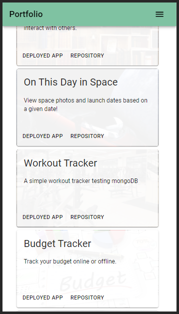

# u20-react-portfolio
## React Portfolio 

### Description 

This application is my first attempt at a React portfolio. It is simple and gets to the point.

Clean color scheme and layout. 4 Pages with reusable header, popup menu, mobile friendly.

There are my 6 top applications (including the inprogress Project 3).

### Img of Heroku Deployment

### Links

[Deployed Application](https://u20-react-portfolio.herokuapp.com/)

[GitHub Repo](https://github.com/epowelldev/u20-react-portfolio)